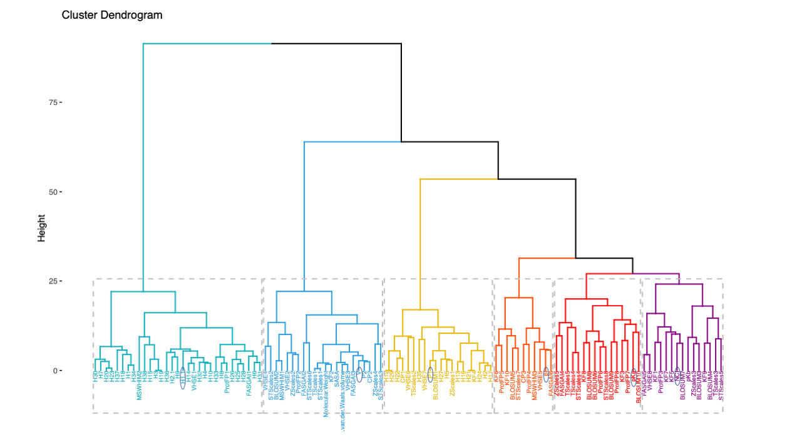

# PC6-protein-encoding-method

The core idea of PC6 encoding method is using physicochemical properties as word embeddings. Each amino acid character in sequence would be replaced to a vector composed by six physicochemical property values.

### 1. Physicochemical properties clustering analysis
We collected physicochemical properties of amino acids from R package ‘Peptides’. After that, we filtered out properties that contain “NA” in the dataset and obtained the remaining 115 properties. Then, we used R function to calculate the correlation between each property and applied clustering analysis through hierarchical clustering. Finally, taking the K-means approach, we determined six as the optimal number of clusters. Therefore, six physicochemical properties were chosen from the six clusters as the following: hydrophobicity (H1), volume of side chains (V), polarity (P1), pH at the isoelectric point (pl), the negative of the logarithm of the dissociation constant for the -COOH group (pKa), and net charge index of side chain (NCI). Those physicochemical properties were further selected as the features in PC6 protein encoding. 


### 2. Protein encoding method
Each amino acid character in a sequence would be replaced by a vector composed of six physicochemical property values. We first obtained a table with 20 amino acids with its corresponding physicochemical properties. Then, we normalized the values in each physicochemical property into the same scale. The character “X” was added for the purpose of sequence padding, and its corresponding values were set to 0 for all six physicochemical properties. Therefore, we generated a protein encoding table containing 21 tokens (20 amino acids and 1 padding character). Considering that the sequences in our AMP dataset have a maximum length of 198, we padded all AMPs to 200 in length. After that, we replaced each token of a sequence with six values based on the PC6 protein encoding table and formed a 200×6 matrix. Finally, all training data would be encoded by this method to generate the input for model training


#### fasta -> dict
```python
from Protein_Encoding import PC_6
PC_6(fasta_name)
```
